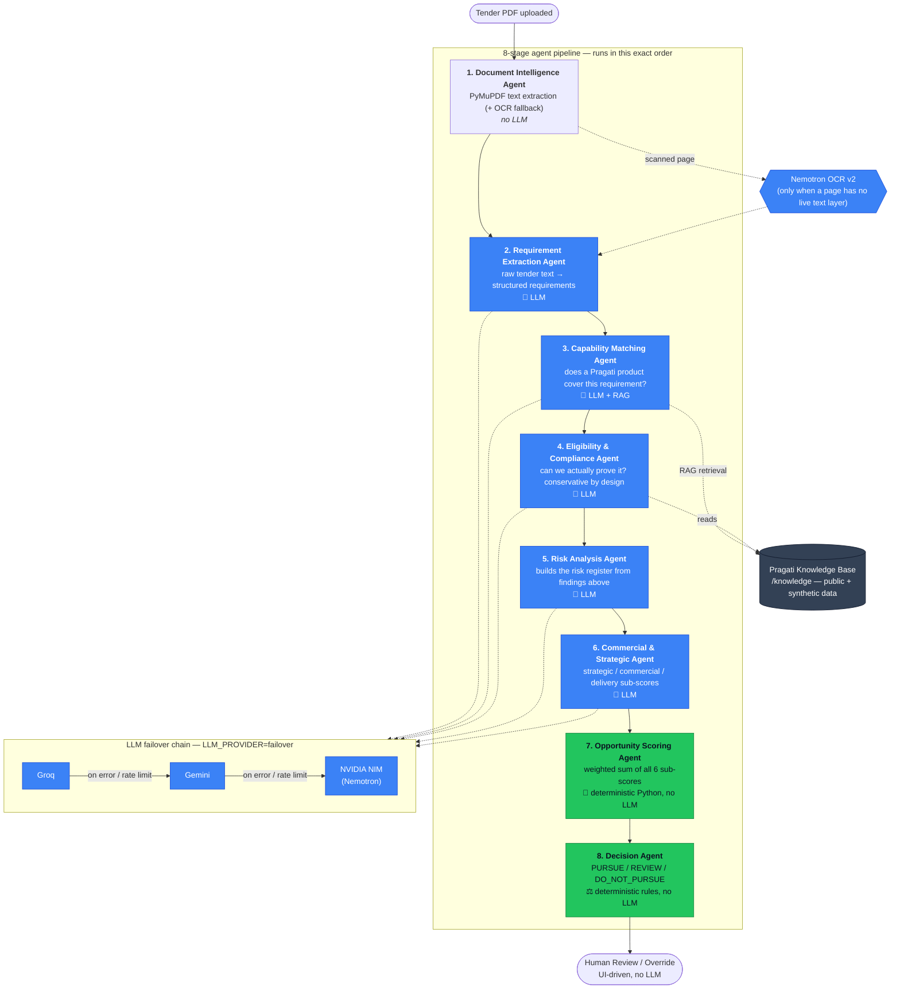

# Pragati Opportunity Intelligence

AI-powered Tender Intelligence & Bid Decision System — a prototype built to
demonstrate, for Pragati Defence Systems Pvt. Ltd., how an AI system can turn
a raw tender/RFP into a structured, explainable, auditable bid decision.

> **This is a prototype.** It uses only publicly available information about
> Pragati (scraped from pragatidefence.com, see `/knowledge`) and
> clearly-labelled **synthetic demo data**. It is not connected to any
> confidential or internal Pragati system.

See [`docs/ARCHITECTURE.md`](docs/ARCHITECTURE.md) for the full system design.

## Agent architecture — who does what

A tender PDF passes through **8 agents in a fixed pipeline**
(`apps/api/app/agents/orchestrator.py`). Only 5 of them call an LLM; the
score and decision are always plain deterministic code, never AI-decided.



**Why only 5 agents use an LLM:** everything upstream of scoring produces
*facts* (a requirement was found, a product matches it, a certificate is
unverified) — that needs real language understanding, so it's LLM-driven,
with RAG for Capability Matching (it retrieves the relevant product entries
from the knowledge base before reasoning over them). Everything from Scoring
onward just *combines* those facts with fixed arithmetic/rules — deliberately
kept out of the LLM's hands so the score/decision stay explainable,
reproducible under Replay, and never able to silently invent a capability or
certification that isn't real.

**Resilience:** every LLM-backed agent has a deterministic fallback (used
offline, and automatically if an LLM response is missing/malformed/uncited),
and `LLM_PROVIDER=failover` chains multiple providers (Groq → Gemini →
NVIDIA) so a rate limit on one doesn't stall the analysis — see
[`docs/ARCHITECTURE.md`](docs/ARCHITECTURE.md) for the full reasoning.

## Quick start (no Docker, no API keys)

Requires Python 3.11+ and Node 20+.

```bash
# 1. Backend
cd apps/api
python3 -m venv .venv && source .venv/bin/activate
pip install -r requirements.txt
cp .env.example .env
uvicorn app.main:app --reload --port 8000

# 2. Frontend (separate terminal)
cd apps/web
npm install
cp .env.example .env.local
npm run dev
```

Open http://localhost:3000, click **Load Demo**, and explore.

The backend defaults to a deterministic, offline mock LLM/OCR provider — the
entire pipeline runs with zero API keys and zero external network calls. To
use real LLM reasoning, set `LLM_PROVIDER` in `apps/api/.env` to one of
`anthropic | openai | groq | gemini | nvidia | failover`, the matching API
key(s), and `ALLOW_EXTERNAL_LLM_CALLS=true`. `failover` chains several
providers (`LLM_FAILOVER_ORDER`, default `groq,gemini,nvidia`) so a rate
limit on one doesn't stall an analysis. For OCR on scanned pages, set
`OCR_PROVIDER=nvidia` and `NVIDIA_OCR_API_KEY` to use Nemotron OCR v2 instead
of the local Tesseract/mock fallback. See `apps/api/.env.example` for every
option.

## Quick start (Docker)

```bash
cd docker
docker compose up --build
```

Brings up Postgres+pgvector, the API (port 8000), and the web app (port 3000).

## Demo script (~3–5 minutes)

1. Open the **Opportunity Center** (`/`) and click **Load Demo** — populates
   10 synthetic tenders spanning helmets, vests, plates, shields, vehicle
   armour, and one deliberately out-of-domain (counter-drone) tender.
2. Open the highest-scored tender (PURSUE). Read the executive summary —
   score, recommendation, why/concerns/actions — in under 30 seconds.
3. Open the **Requirements** tab, click any row — the right-hand panel shows
   the source page, section, original text snippet, and the AI's
   capability-match evidence with a knowledge-base reference.
4. Open **Compliance** — note that certification claims are `UNKNOWN`
   (unverified), never silently upgraded to a pass.
5. Open **Risks**, **Score** (see the weighted factor breakdown), and
   **Timeline** (full audit log of the pipeline run).
6. Open **Agent Runs** — per-agent status/duration/retries. Then visit
   `/admin` for the cross-tender observability view; the two demo tenders
   seeded with a simulated `OCR_TIMEOUT` / `INVALID_JSON` failure show a real
   retry → fallback → success story.
7. Click **Human Review / Override**, submit an override with a reason —
   watch it land in the Timeline as a `HUMAN_OVERRIDE` event.
8. Open **Replay**, pick `score-v2`, run it — compare the old/new score and
   recommendation side by side.
9. Click **View Report** / **Download PDF** for the executive report.
10. Try `/upload` with your own tender PDF, and `/search` across all tenders.

## Project structure

```
apps/
  api/            FastAPI backend (agents, DB models, routers, services)
  web/             Next.js frontend
knowledge/         Public/synthetic Pragati capability knowledge base
docker/            docker-compose.yml (Postgres+pgvector, api, web)
docs/              Architecture notes
```

## Testing

```bash
cd apps/api
source .venv/bin/activate
pip install -r requirements-dev.txt
pytest -q
```

50 tests covering the deterministic scoring/decision logic, capability
matching (including the LLM+RAG path's citation-validation safety net),
the mock extraction engine, the LLM failover chain, and full API integration
flows (upload → analyze → override → replay → report, plus the failure
simulator).

## Priority scope note

Per the spec's own priority ordering, everything through "Report Generation"
(items 1–12) is fully implemented end-to-end. "Advanced observability"
(item 13) is implemented at MVP depth: per-agent run logs and a cross-tender
observability page, rather than distributed tracing / cost metering.
