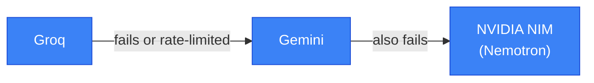

# Pragati Opportunity Intelligence

AI-powered Tender Intelligence & Bid Decision System — a prototype built to
demonstrate, for Pragati Defence Systems Pvt. Ltd., how an AI system can turn
a raw tender/RFP into a structured, explainable, auditable bid decision.

> **This is a prototype.** It uses only publicly available information about
> Pragati (scraped from pragatidefence.com, see `/knowledge`) and
> clearly-labelled **synthetic demo data**. It is not connected to any
> confidential or internal Pragati system.

## Agent architecture — who does what

A tender PDF goes through **8 agents, one after another, always in this
order**. Think of it like a document moving down an assembly line — each
station does one job and hands its output to the next.


🔵 **Blue = an AI model does the thinking here.** 🟢 **Green = plain code does
fixed math/rules — no AI involved, ever.**

| # | Agent | What it actually does, in plain terms | Uses AI? |
|---|---|---|---|
| 1 | **Document Intelligence** | Opens the PDF and pulls out the raw text. If a page is a scanned image with no real text on it, it sends that page to an OCR model instead of skipping it. | No |
| 2 | **Requirement Extraction** | Reads the messy tender language and turns it into a clean checklist: "the helmet must weigh under 1kg," "delivery within 30 days," etc. | ✅ Yes |
| 3 | **Capability Matching** | For every item on that checklist, looks up Pragati's real product catalogue and asks "do we actually make something that covers this?" It looks up the relevant products *first*, then reasons over just those (that lookup-then-reason pattern is called RAG). | ✅ Yes (+ lookup) |
| 4 | **Eligibility & Compliance** | A stricter second check specifically for certifications and eligibility rules. It's deliberately paranoid: a certificate that's *claimed* but not *proven* stays marked "unverified," never gets waved through as a pass. | ✅ Yes |
| 5 | **Risk Analysis** | Looks at everything found in steps 3 and 4 and writes up what could realistically go wrong (e.g. "this certification isn't confirmed" becomes a real risk entry with a suggested fix). | ✅ Yes |
| 6 | **Commercial & Strategic** | Judges how attractive this deal is as a business opportunity — market fit, deal size, whether the delivery timeline is realistic. | ✅ Yes |
| 7 | **Opportunity Scoring** | Takes the numbers produced by steps 2–6 and combines them into one final score out of 100, using a fixed weighted formula. No AI touches this step — it's the same arithmetic every time. | No — pure math |
| 8 | **Decision** | Turns the score into PURSUE / REVIEW / DO NOT PURSUE using fixed business rules (e.g. "if a mandatory requirement has no match, it can never be an automatic PURSUE"). | No — fixed rules |

After step 8, a **person** reviews the recommendation on the dashboard and
can agree with it or override it — the system never submits a bid decision
on its own.

**Why steps 7 and 8 are never AI:** everything before them produces *facts*
(a requirement exists, a product matches it, a certificate is unverified) —
finding those facts needs real language understanding, so that part is
AI-driven. But turning those facts into a *score* and a *decision* is just
arithmetic and if/else rules on purpose, so the result is always explainable
("why is the score 78?" has a real answer, not "the AI felt like it"),
repeatable, and can never quietly invent a capability or certificate that
doesn't actually exist.

### If one AI provider fails, another takes over

Steps 2–6 above call an LLM (Groq, Gemini, or NVIDIA, depending on config).
When `LLM_PROVIDER=failover` is set, the system tries them in order and
automatically moves to the next one if a call fails or hits a rate limit —
so one provider having a bad moment doesn't stop the whole analysis.



Two more things worth knowing:
- **Scanned pages** (a page that's just a photo of text, no real text layer)
  get sent to **NVIDIA's Nemotron OCR v2** model instead of being skipped —
  this only happens for that specific page, not every page.
- **Steps 3 and 4** don't just guess — they read from
  [`/knowledge`](knowledge), a small local file of Pragati's real, publicly
  published product specs and company facts, before answering.

See [`docs/ARCHITECTURE.md`](docs/ARCHITECTURE.md) for the full system design.

## Quick start (no Docker, no API keys)

Requires Python 3.11+ and Node 20+.

```bash
# 1. Backend
cd apps/api
python3 -m venv .venv && source .venv/bin/activate
pip install -r requirements.txt
cp .env.example .env
uvicorn app.main:app --reload --port 8000

# 2. Frontend (separate terminal)
cd apps/web
npm install
cp .env.example .env.local
npm run dev
```

Open http://localhost:3000, click **Load Demo**, and explore.

The backend defaults to a deterministic, offline mock LLM/OCR provider — the
entire pipeline runs with zero API keys and zero external network calls. To
use real LLM reasoning, set `LLM_PROVIDER` in `apps/api/.env` to one of
`anthropic | openai | groq | gemini | nvidia | failover`, the matching API
key(s), and `ALLOW_EXTERNAL_LLM_CALLS=true`. `failover` chains several
providers (`LLM_FAILOVER_ORDER`, default `groq,gemini,nvidia`) so a rate
limit on one doesn't stall an analysis. For OCR on scanned pages, set
`OCR_PROVIDER=nvidia` and `NVIDIA_OCR_API_KEY` to use Nemotron OCR v2 instead
of the local Tesseract/mock fallback. See `apps/api/.env.example` for every
option.

## Quick start (Docker)

```bash
cd docker
docker compose up --build
```

Brings up Postgres+pgvector, the API (port 8000), and the web app (port 3000).

## Demo script (~3–5 minutes)

1. Open the **Opportunity Center** (`/`) and click **Load Demo** — populates
   10 synthetic tenders spanning helmets, vests, plates, shields, vehicle
   armour, and one deliberately out-of-domain (counter-drone) tender.
2. Open the highest-scored tender (PURSUE). Read the executive summary —
   score, recommendation, why/concerns/actions — in under 30 seconds.
3. Open the **Requirements** tab, click any row — the right-hand panel shows
   the source page, section, original text snippet, and the AI's
   capability-match evidence with a knowledge-base reference.
4. Open **Compliance** — note that certification claims are `UNKNOWN`
   (unverified), never silently upgraded to a pass.
5. Open **Risks**, **Score** (see the weighted factor breakdown), and
   **Timeline** (full audit log of the pipeline run).
6. Open **Agent Runs** — per-agent status/duration/retries. Then visit
   `/admin` for the cross-tender observability view; the two demo tenders
   seeded with a simulated `OCR_TIMEOUT` / `INVALID_JSON` failure show a real
   retry → fallback → success story.
7. Click **Human Review / Override**, submit an override with a reason —
   watch it land in the Timeline as a `HUMAN_OVERRIDE` event.
8. Open **Replay**, pick `score-v2`, run it — compare the old/new score and
   recommendation side by side.
9. Click **View Report** / **Download PDF** for the executive report.
10. Try `/upload` with your own tender PDF, and `/search` across all tenders.

## Project structure

```
apps/
  api/            FastAPI backend (agents, DB models, routers, services)
  web/             Next.js frontend
knowledge/         Public/synthetic Pragati capability knowledge base
docker/            docker-compose.yml (Postgres+pgvector, api, web)
docs/              Architecture notes
```

## Testing

```bash
cd apps/api
source .venv/bin/activate
pip install -r requirements-dev.txt
pytest -q
```

50 tests covering the deterministic scoring/decision logic, capability
matching (including the LLM+RAG path's citation-validation safety net),
the mock extraction engine, the LLM failover chain, and full API integration
flows (upload → analyze → override → replay → report, plus the failure
simulator).

## Priority scope note

Per the spec's own priority ordering, everything through "Report Generation"
(items 1–12) is fully implemented end-to-end. "Advanced observability"
(item 13) is implemented at MVP depth: per-agent run logs and a cross-tender
observability page, rather than distributed tracing / cost metering.
